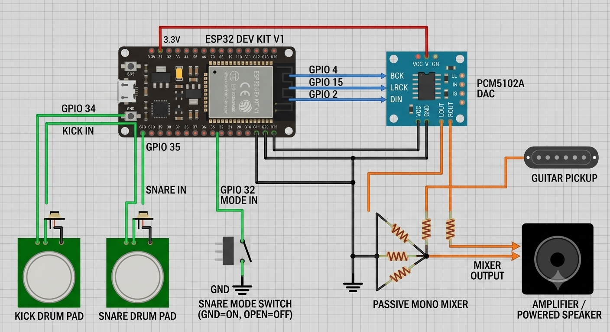

# AlekBeat32 Drum Project

A reggae-inspired electronic drum project built around an ESP32. It combines two trigger pads, selectable snare samples, web-based controls, and an external audio output that can be mixed with a guitar pickup.

## Features

- Two input pads:
  - Kick/bass pad
  - Drum/snare pad
- Snare mode switch:
  - Energized: snare on
  - Unenergized: snare off
- Web server controls for kick and snare volume
- Web frequency/tone generation for testing
- PCM5102A I2S audio output
- Passive mono mixing with a guitar pickup
- Wi-Fi access point hosted by the ESP32

## Components

- ESP32 development board
- PCM5102A I2S DAC
- Passive mono mixer
- Guitar pickup
- Two drum or piezo pad inputs
- Snare mode switch
- Wires, power supply, and suitable audio connections

## Wiring

The current pin assignments are:

| Function | ESP32 pin |
| --- | ---: |
| Kick/bass pad input | GPIO 34 |
| Drum/snare pad input | GPIO 35 |
| Snare mode switch | GPIO 32 |
| PCM5102A BCLK | GPIO 4 |
| PCM5102A LRCK/WS | GPIO 15 |
| PCM5102A DATA | GPIO 2 |

GPIO 32 uses `INPUT_PULLUP`. The switch is read as snare-on when the input is energized or pulled LOW, and snare-off when it is unenergized or HIGH.

### Circuit Diagram

Replace the placeholder below with the final wiring diagram image:



The PCM5102A output and the guitar pickup are connected to the passive mono mixer. Follow the electrical requirements of your specific mixer, DAC, amplifier, and power supply when completing the wiring.

## Web Controls and Wi-Fi

After the firmware starts, the ESP32 creates this Wi-Fi access point:

| Setting | Value |
| --- | --- |
| Network name | `ALEKTRONIC DRUM` |
| Password | `drum1234` |
| Device address | `192.168.4.1` |
| HTTP server | Port 80 |
| WebSocket server | Port 81 |

Connect a phone or computer to the access point and open:

```text
http://192.168.4.1/
```

The web interface is served from LittleFS and provides volume controls, drum test triggers, snare-mode control, and frequency/tone generation.

## PlatformIO Setup

This project currently uses **PlatformIO with the Arduino framework**. It is not a native ESP-IDF project.

The project configuration uses:

- Board: `esp32dev`
- Platform: `espressif32`
- Framework: Arduino
- Filesystem: LittleFS
- Serial monitor speed: `115200`

Install [PlatformIO](https://platformio.org/) in VS Code, connect the ESP32 by USB, and run these commands from the project directory:

```bash
pio run
pio run -t upload
pio device monitor -b 115200
```

The web interface files must be placed in a `data/` directory before uploading the LittleFS filesystem:

```bash
pio run -t uploadfs
```

The `data/` directory is not included in the current repository, so `uploadfs` will only be useful after the filesystem assets have been added.

## Browser Web Flasher

The project has a browser flasher at:

[Open the AlekBeat32 Web Flasher](https://alektronics.github.io/AlekBeat32/flasher/)

### Upload using the Web Flasher

1. Use Chrome or Microsoft Edge on a desktop computer. The browser must support Web Serial or WebUSB.
2. Connect the ESP32 to the computer with a USB data cable.
3. Close PlatformIO Monitor and any other application using the ESP32 serial port.
4. Put the ESP32 into bootloader mode if the board does not enter it automatically. Usually this means holding **BOOT**, starting the connection, and releasing **BOOT** when flashing begins.
5. Open the Web Flasher link.
6. Select **Connect & Flash**.
7. Choose the ESP32 serial device and approve the browser permission request.
8. Follow the prompts until the firmware upload finishes.
9. Connect your phone or computer to the `ALEKTRONIC DRUM` Wi-Fi network and open `http://192.168.4.1/`.

### Current flasher status

The flasher page and `flasher/index.html` are present, but `flasher/manifest.json` currently contains empty `firmware` and `filesystem` lists. The generated firmware and LittleFS artifact URLs must be added to that manifest before browser flashing can work. Until then, use PlatformIO USB upload.

## Audio and Runtime Defaults

- Audio sample rate: `22050 Hz`
- Four simultaneous voices are available for each drum sample pool.
- Kick and snare threshold: `100`
- Input debounce time: `200 ms`
- Serial monitor tone test:
  - Send `t` for a 440 Hz tone for 500 ms
  - Send `T` for a 440 Hz tone for 1500 ms

## Project Structure

```text
src/main.cpp       ESP32 application
src/kick.h         Kick sample data
src/snare_on.h     Snare-on sample data
src/snare_off.h    Snare-off sample data
flasher/            Browser flasher page and manifest
platformio.ini     PlatformIO project configuration
```

## License

Add the project license here when one is selected.
